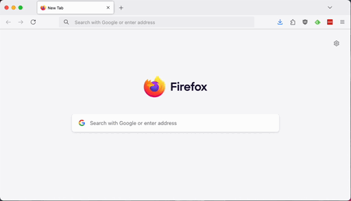

# Repo Shortcuts

This Firefox extension allows you to quickly navigate to your Git repositories.  
Save your repositories via the settings menu (`⌘ + .` or `Ctrl + .` > **Settings**) and access them using hotkeys.

Currently only works for repositories hosted on `github.com` and `bitbucket.org`.

### Hotkeys
- **`⌘ + .` or `Ctrl + .`**: Open the repository list popup. Start typing to search.  
- **`↑`, `↓`**: Navigate through the list.  
- **`Enter`**: Open the selected repository in a new tab.  
- **`⌘Enter`**: Open the selected repository in a new tab, but keep the current tab active.  
- **`Shift+Enter`**: Open the selected repository in the current tab.  

### Special Modes
To open a repository in a specific mode, type one of the following characters followed by a space (`<space>`), type your search text, then hit `<Enter>`:  
- **Default (no prefix)**: View pull requests.  
- **`p`**: Create a pull request.  
- **`c`**: View commits.  
- **`s`**: View source code.  

## Why does this exist?
This extension was originally created for personal use to efficiently navigate a large list of repositories and quickly create pull requests using the keyboard.  

Unfortunately, regular Firefox [does not allow permanently installing local extensions](https://stackoverflow.com/questions/47363481/install-a-personal-firefox-web-extension-permanently) without signing them.

To avoid having to reinstall the extension repeatedly after restarting my browser, I decided to sign and publish it. I updated the extension to make it usable for others by replacing the hardcoded list of repositories with a customizable list and a settings menu.

## Installation
Install via [Firefox add-ons](https://addons.mozilla.org/en-US/firefox/addon/repo-shortcuts/).

#### Or install locally
* Clone this repo
* In Firefox navigate to `about:debugging` > This Firefox > Load Temporary Add-on
* Select `manifest.json` from the cloned repo

## Todo's
* Error messages
* Add custom git hosts
* When saving don't remove invalid repo's, keep previous valid version
* Delete repo button in settings
* Test as chrome extension
* Test non-mac shortcuts
* Make hotkeys configurable
* Typescript?
* lint or .editorconfig or ...: Fix mixed indentation and mixed single/double quotes
* Improve quality of preview gif
* Don't use markdown in [description of add-on](https://addons.mozilla.org/en-US/firefox/addon/repo-shortcuts/).
* Missing firefox extension icon
